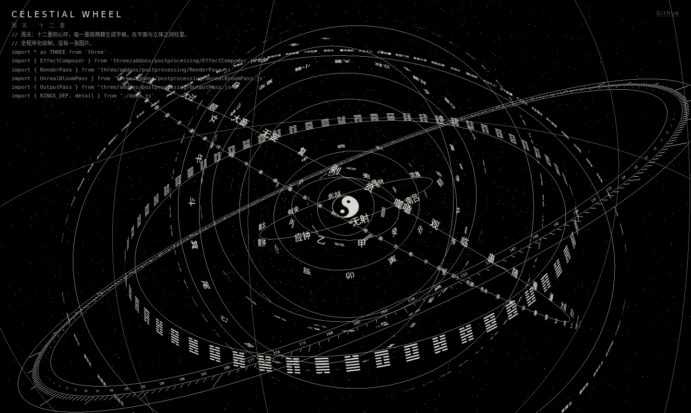

# Celestial Wheel · 周天

十二重同心环的实时特效。每一重按中国古代典籍的次第排布字格：先天八卦、十天干、十二地支、
十二律吕、十二长生、二十四节气、二十八宿、六十甲子、六十四卦、七十二候。环各自旋转，
在平面与立体之间往复，鼠标停在任一字格上会聚焦并给出它是什么。

全程序化绘制，**没有一张图片**。字格是运行时画进 canvas 纹理的。

演示页左边是一个代码打字机，打的就是这个库自己的源码。



## 看效果

```bash
git clone https://github.com/zaoxu001/celestial-wheel
cd celestial-wheel
python3 -m http.server 8000
```

然后打开 <http://localhost:8000>。

必须用 http 打开，不能双击 `index.html`。ES 模块和 `fetch` 在 `file://` 下会被浏览器拦住。

## 用在自己的项目里

```js
import { createCelestialWheel } from './src/celestial-wheel.js'

const wheel = createCelestialWheel(document.querySelector('#host'), {
  onFocus(info) {
    // 鼠标停在某个字格上时触发，离开时 info 为 null
    console.log(info?.label, info?.text)
  },
})

wheel.setMode('landing')   // 'landing' 平面与立体往复 · 'calm' 静置作底景
wheel.dispose()            // 卸载时务必调用，会摘掉事件与 WebGL 资源
```

需要 three.js 0.160 或更高。演示页用 importmap 从 CDN 取，自己的项目按自己的打包方式引入即可。

### API

| 方法 | 作用 |
|---|---|
| `setMode(mode)` | `'landing'` 平面与立体之间往复；`'calm'` 静置，适合当页面底景 |
| `focusCell(ringKey, index)` | 主动聚焦某一重环上的某个字格 |
| `leave()` | 取消聚焦 |
| `dispose()` | 停止渲染，移除事件监听与 WebGL 资源 |

## 代码打字机

单独一个模块，跟周天没有依赖关系，可以拿去单用。

```js
import { createCodeTicker, fetchLines } from './src/code-ticker.js'

createCodeTicker(document.querySelector('pre'), {
  lines: await fetchLines('./src/celestial-wheel.js'),
  cps: 55,   // 每秒打多少个字符
})
```

它和常见的打字机效果有三点不同，也是它存在的理由：

- **不中断**。字与字、行与行之间节奏恒定，不插停顿。
- **不重来**。打满一屏之后从顶部滚走旧行，像终端一样继续往下，而不是清屏从头开始。
- **只有刷新才回到起点**。源码行用完会循环取用，但屏幕上的内容一直往下流。

判断"打满了"用的是渲染后的高度而不是行数。按行数算的话，遇到一行特别长、在窄容器里折成三四行的情况，
会以为还没满，实际早就溢出了。

## 字体

演示页没有绑定任何付费字体。环上的汉字用系统衬线体渲染，在装了思源宋体或者宋体的机器上观感最好。
想换字体，改 `src/celestial-wheel.js` 顶部的 `FONT` 常量。

## 相关项目

**[天秩](https://tianzhi.live)** · 东方术数的研究与学习平台，涵盖八字、六壬、六爻、奇门、紫微、梅花，以典籍为据，把术数里属于推算的那一部分还原成可检验的算法。此开源项目为天秩的首页特效。

**[shushu](https://github.com/zaoxu001/shushu)** · 东方术数的核心算法，MIT 许可。历法与真太阳时、干支五行关系、排盘、力量量化、旺衰分档、调候取用、月令格局、岁运引动、合盘。只做计算不做解释，返回结构化数据与术语标签，算法由典籍整理量化而来。

## 许可

MIT。数据部分是八卦、干支、节气、星宿这类公共领域的典籍常识。
